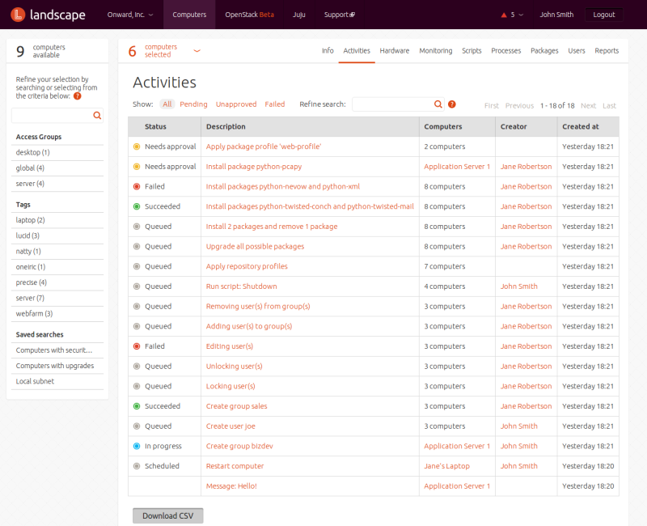
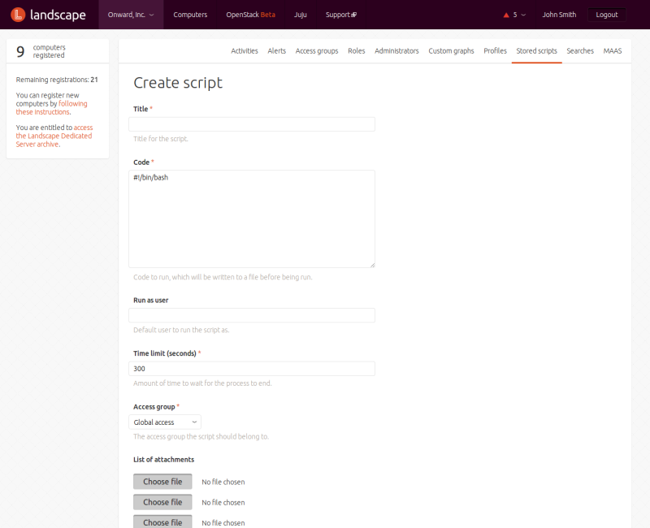
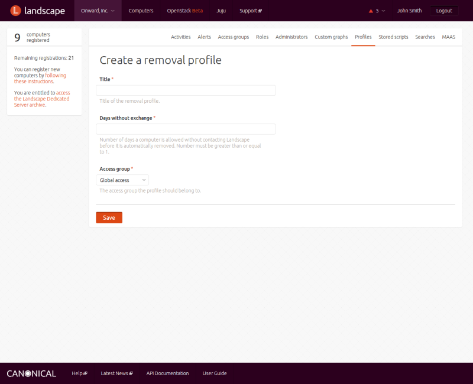

# Managing computers

## Registering computers

When you first install Landscape, your computers are not known to the Landscape
server. To manage them, you must register them with the server.  Complete
instructions for registering client computers with a Landscape server are
available at https://yourserver/standalone/how-to-register. You can get to this
page by first clicking on the menu item for your account page on the top menu,
then on the link in the box on the left side of the page.

## Selecting computers

You can select one or more computers individually, or by using searches or
tags. For each of those approaches, the starting place is the COMPUTERS menu
entry at the top of the screen. Clicking on it displays a list of all computers
Landscape knows about.

- To select computers individually, tick the boxes beside their names in the
  Select computers list.

- Using searches - The upper left corner of the Select computers screen
  displays the instructions "Refine your selection by searching or selecting
  from the tags below," followed by a search box. You can enter any string in
  that box and press Enter, or click the arrow next to the box. Landscape will
  search both the name and hostname associated with all computers for a match
  with the search term. Searches are not case-sensitive. A list of matching
  computers is displayed on the right side of the screen.

Once you've selected a group of computers, you can apply a tag to them to make
it easier to find them again. To do so, with your computers selected, click on
INFO under COMPUTERS. In the box under Tags:, enter the tag you want to use and
click Add.

- Using tags - Any tags you have already created appear in a list under the
  search box on the left of the Computers screens. You can click on any tag to
  display the list of computers associated with it. To select any of the
  displayed computers, tick the box next to its name, or click Select: All link
  at the top of the list.

## Information about computers

By clicking on several submenus of the COMPUTERS menu, you can get information
about selected computers.

- Clicking on ACTIVITIES displays information about actions that may be applied
  to computers. You can filter the activity log to show All, Pending,
  Unapproved, or Failed activities. You can click on each activity in the list to
  display a screen showing details about the activity. On that screen you can
  Approve, Cancel, Undo, or Redo the activity by clicking on the relevant button.

- Clicking on HARDWARE displays information about the selected computer's
  processor, memory, network, storage, audio, video, PCI, and USB hardware, as
  well as BIOS information and CPU flags. 

- Clicking on PROCESSES displays information about all processes running on a
  computer at the last time it checked in with the Landscape server, and lets
  you end or kill processes by selecting them and clicking on the relevant
  buttons.

- Clicking on REPORTS displays seven pie charts that show what percentage of computers:
 - are securely patched
 - are covered by upgrade profiles
 - have contacted the server within the last five minutes
 - have applied security updates - four charts show computers that have applied
   Ubuntu Security Notices within the last two, 14, 30, and 60+ days

- Clicking on MONITORING displays graphs of key performance statistics, such as
  CPU load, memory use, disk use, and network traffic. 

  
You can also create custom graphs to display at the top of the page by clicking
on the Create some now! link. A drop-down box at the top of the page lets you
specify the timeframe the graph data covers: one day, three days, one week, or
four weeks. You can download the data behind each graph by clicking the
relevant button under the graph.

## The activity log

The right side of the dashboard that displays when you click on your account
menu, and when you click on the ACTIVITIES submenu, shows the status of
Landscape activities, displayed in reverse chronological order.

  
You can view details on an individual activity by clicking on its description.
Each activity is labeled with a status; possible values are:

- Succeeded
- In progress
- Scheduled
- Queued
- Unapproved
- Cancelled
- Failed

You can select a subset to view by clicking on the links above the table for
All, Pending, Unapproved, or Failed activities.

In addition to the status and description of each activity, the table shows
what computers the activity applied to, who created it, and when.

## Managing users

Clicking on USERS displays a list of users on each of the selected computers.

  
You can select one or more users, then click one of the buttons at the top of
the screen:

- The ADD button lets you add a new user to the selected computers. 

You must specify the person's name, a username, and a passphrase. You may also
specify a location and telephone numbers. Click the ADD button at the bottom of
the screen to complete the operation.

- The DELETE button displays a screen that lets you delete the selected users. 

You may also tick a checkbox to delete the user's home folders as well. Press
the Delete button at the bottom of the screen to complete the operation.

- The EDIT button displays a User details screen that lets you change details
  such as the person's name, primary group, passphrase, location, and telephone
  numbers, and add or remove the user from groups on the selected computers.

- The LOCK button prevents the selected users from logging into their accounts.

- The UNLOCK button lets users into their cars when they've accidentally locked
  their keys inside. Actually, no, it simply unlocks previously locked
  accounts.

## Managing alerts

Landscape uses alerts to notify administrators of conditions that require
attention. The following types of alerts are available:

- when a pending computer needs to be accepted or rejected
- when you are exceeding your license entitlements for Landscape Dedicated
  Server (This alert does not apply to the hosted version of Landscape.)
- when new package updates are available for computers
- when new security updates are available for computers
- when a package profile is not applied
- when package reporting fails (Each client runs the command **apt-get update**
  every 60 minutes. Anything that prevents that command from succeeding is
  considered a package reporting failure.)
- when an activity requires explicit administrator acceptance or rejection
- when a computer has not contacted the Landscape server for more than five minutes
- when computers need to be rebooted in order for a package update (such as a
  kernel update) to take effect

To configure alerts, click on the Configure alerts link in the dashboard, or
click on your account's ALERTS menu item. Tick the check box next to each type
of alert you want to subscribe to, or click the All or None buttons at the top
of the table, then click on the Subscribe or Unsubscribe button below the
table.

The Alerts screen shows the status of each alert. If an alert has not been
tripped, the status is OK; if it has, the status is Alerted. The last column
notes whether the alert applies to your account (pending computers, for
instance, are not yet Landscape clients, but they are part of your account), to
all computers, or to a specified set of tagged computers.

If an alert is tripped, chances are an administrator should investigate it.
You can see alerts on the account dashboard that displays when you click on
your account name on the top menu. The description for each alert is a link;
click on it to see a table of alerts. When you click on an alert, the resulting
screen shows relevant information about the problem. For instance, if you click
on an alert about computers having issues reporting packages, the table shows
the computer affected, the error code, and error output text.

On some alert screens you can download the list of affected computers as a CSV
file or save the criteria that generated the alert as a saved search by
clicking the relevant button at the bottom of the screen.

## Managing scripts

Landscape lets you run scripts on the computers you manage in your account.
The scripts may be in any language, as long as an interpreter for that language
is present on the computers on which they are to run. You can maintain a
library of scripts for common tasks. You can manage scripts from the STORED
SCRIPTS menu under your account, and run them against computers from the
SCRIPTS menu under COMPUTERS.

The Stored scripts screen displays a list of existing scripts, along with the
access groups each belongs to and its creator.

  
You can edit a script by clicking on its name. To delete a stored script, tick
the check box next to its name, then click Remove. If you have the proper
permissions, Landscape erases the script immediately without asking for
confirmation.

From the Stored scripts screen you can add a new script by clicking on Add
stored script.

  
On the Create script screen you must enter a title, interpreter, the script
code, the time within which the script must complete, and the access group to
which the script belongs. You may enter a default user to run the script as; if
you don't, you will have to specify the user when you choose to run the script.
You may also attach as many as five files with a maximum of 1MB in total size.
On each computer on which a script runs, attachments are placed in the
directory specified by the environment variable LANDSCAPE_ATTACHMENTS, and are
deleted once the script has been run. After specifying all the information for
a stored script, click on Save to save it.

To run a stored script, go to the SCRIPTS menu under COMPUTERS. Here you can
choose to run a stored script, or run a new script.

When you choose to run an existing script, Landscape displays the script
details, which allows you to modify any information. You must specify the user
on the target computers to run the script as, and schedule the script to run
either as soon as possible, or at a specified time. When you're ready to run
the script, click on Run.

To run a new script, you must enter most of the same information you would if
you were creating a stored script, with three differences.

On this screen you must specify the user on the target computers to run the
script as, and you may optionally tick a check box to store the script in your
script library. You must also schedule the script to run either as soon as
possible, or at a specified time. When you're ready to run the script, click on
Run.

## Managing upgrade profiles

An upgrade profile defines a schedule for the times when upgrades are to be
automatically installed on the machines associated with a specific access
group. You can associate zero or more computers with each upgrade profile via
tags to install packages on those computers. You can also associate an upgrade
profile with an access group, which limits its use to only computers within the
specified access group. You can manage upgrade profiles from the UPGRADE
PROFILES link in the PROFILES choice under your account.

When you do so, Landscape displays a list of the names and descriptions of
existing upgrade profiles.

To see the details of an existing profile, click on its name to display a
screen that shows the name, schedule, and tags of computers associated with the
upgrade profile. If you want to change the upgrade profile's name or schedule,
click on the Edit upgrade profile link. If you want to change the computers
associated with the upgrade profile, tick or untick the check boxes next to the
tags on the lower part of the screen, then click on the Change button. Though
you can see the access group associated with the upgrade profile, you cannot
change the access groups anywhere but from their association with a computer.

To add an upgrade profile, click on the Add upgrade profile link.

On the resulting Create an upgrade profile screen you must enter a name for the
upgrade profile. Names can contain only letters, numbers, and hyphens. You may
check a box to make the upgrade profile apply only to security upgrades; if you
leave it unchecked, it will target all upgrades. Specify the access group to
which the upgrade profile belongs from a drop-down list. Finally, specify the
schedule on which the upgrade profile can run. You can specify a number of
hours to let the upgrade profile run; if it does not complete successfully in
that time, Landscape will trigger an alert. Click on the Save button to save
the new upgrade profile.

To delete one or more upgrade profiles, tick a check box next to the upgrade
profiles' names, then click on the Remove button.

## Managing removal profiles

A removal profile defines a maximum number of days that a computer can go
without exchanging data with the Landscape server before it is automatically
removed. If more days pass than the profile's "Days without exchange", that
computer will automatically be removed and the license seat it held will be
released. This helps Landscape keep license seats open and ensure Landscape is
not tracking stale or retired computer data for long periods of time. You can
associate zero or more computers with each removal profile via tags to ensure
those computers are governed by this removal profile. You can also associate a
removal profile with an access group, which limits its use to only computers
within the specified access group. You can manage removal profiles from the
REMOVAL PROFILES link in the PROFILES choice under your account.

When you do so, Landscape displays a list of the names and descriptions of
existing removal profiles.

To see the details of an existing profile, click on its name to display a
screen that shows the title, name and number of days without exchange before
the computer is automatically removed, and tags of computers associated with
the removal profile. If you want to change the removal profile's title or
number of days before removal, click on the Edit removal profile link. If you
want to change the computers associated with the removal profile, tick or
untick the check boxes next to the tags on the lower part of the screen, then
click on the Change button. Though you can see the access group associated
with the removal profile, you cannot change the access groups anywhere but
from their association with a computer.

To add a removal profile, click on the Add removal profile link.

On the resulting Create a removal profile screen you must enter a title for the
removal profile. Specify the access group to which the removal profile belongs
from a drop-down list. Finally, specify the number of days without exchange
that computers will be allowed without contact before they are automatically
removed and their license seat is released. If a computer does not contact
Landscape within that number of days, it will subsequently be removed. Click on
the Save button to save the new removal profile.

To delete one or more removal profiles, tick a check box next to the removal
profiles' names, then click on the Remove button.
