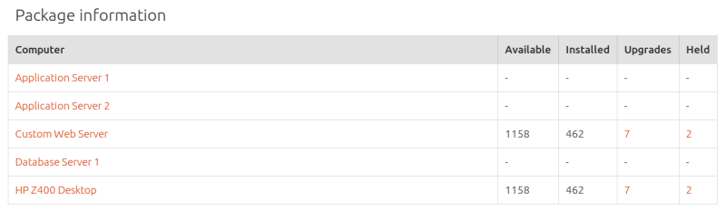
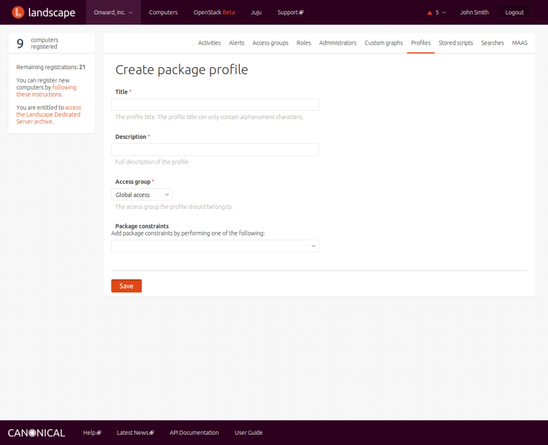

Title: Managing packages

# Managing packages

A package is a group of related files that comprise everything you need to
install an application. Packages are stored in repositories, and each package
is managed via a package profile, which is a record of the package's
dependencies and conflicts.

## Package information

Clicking on PACKAGES under the COMPUTERS menu displays a screen where you can
search for information about all the packages Landscape knows about. You may
first specify a package name or other search string, then press Enter or click
on the arrow next to the box. Landscape then displays a list of packages that
meet the search criteria.

  
The top of the screen displays summary information about the packages:
clickable links to which computers have security updates and other upgrades to
be installed, and the number of computers that are up-to-date and those that
have not reported package information.

The next section provides a list of security issues on computers that need
security updates. You can click on the name or USN number of a security issue
to see a full Ubuntu Security Notice.

The third section displays package information in the form of four numbers for
each selected computer: the number of packages available and installed,
pending upgrades, and held upgrades. You can click on the number of pending or
held upgrades to see a screen that lets you modify the relevant package list
and set a time for the upgrades to take place:

Finally, a Request upgrades button at the bottom of the screen lets you
quickly request that all possible upgrades be applied to the selected
computers. Any resulting activities require explicit administrator approval.

## Adding a package profile

Landscape uses package profiles (also called meta packages) to make sure the
proper software is installed when you request packages. You can think of a
package profile as a package with no file contents, just dependencies and
conflicts. With that information, the package profile can trigger the
installation of other packages necessary for the requested package to run, or
trigger the removal of software that conflicts with the requested package.
These dependencies and conflicts fall under the general category of
constraints.

To manage package profiles, click the PROFILES menu entry under your account
and the Package profiles link. The Package profiles screen displays a list of
existing package profiles and a link that you can click to add a new package
profile.

Click on that link to display the Create package profile screen:

Here you enter a name for the package profile, a description (which appears at
the top of the package profile's information screen), the access group to
which the package profile should belong, and, optionally, any package
constraints - packages that this profile depends on or conflicts with. The
constraints drop-down lists lets you add constraints in three ways: based on a
computer's installed packages, imported from a previously exported CSV file or
the output of the **dpkg --get-selections** command, or manually added. Use
the first option if you want to replicate one computer to another, as it makes
all currently installed packages that are on the selected computer
dependencies of the package profile you're creating. The second approach
imports the dependencies of a previously exported package profile. The manual
approach is suitable when you have few dependencies to add, all of which you
know.

When you save a package profile, behind the scenes Landscape creates a Debian
package with the specified dependencies and conflicts and gives it a name and
a version. Every time you change the package profile, Landscape increments the
version by one.

If Landscape finds computers on which the package profile should be installed,
it creates an activity to do so. That activity will run unattended, except
that you must provide explicit administrator approval to remove any packages
that the package profile wants to delete.

## Exporting a package profile

You can export a package profile in order to use the same constraints it's set
up for with a new package profile. To export a package profile, click the
PROFILES menu entry under your account and the Package profiles link. Tick the
check box next to the packages you want to export, then click Download as CSV.

## Modifying a package profile

To modify a package profile, click the  PROFILES menu entry under your account
and the Package profiles link, then click on the name of a package profile in
the list.

## Deleting a package profile

To delete a package profile, click the  PROFILES menu entry under your account
and then the  Package profiles link. Tick the check box next to the packages
you want to delete, then click Remove. The package profile is deleted
immediately, with no prompt to confirm the action.

## Repositories

Packages are stored in repositories. A repository is simply a designated
location that stores packages. You can manage Landscape repositories only via
[the Landscape API][landscapeapi]

[landscapeapi]: ./landscape-api.md
